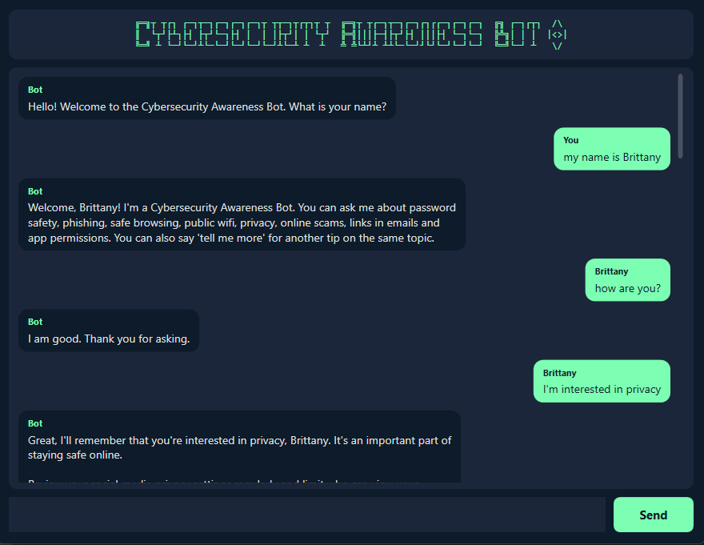
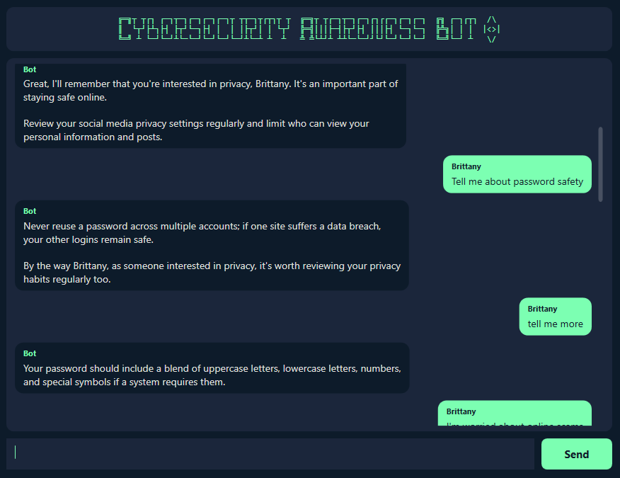
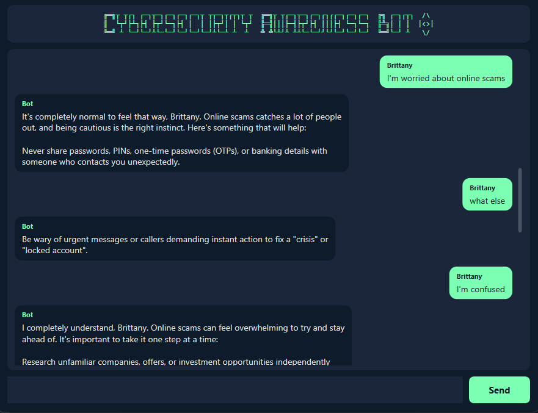
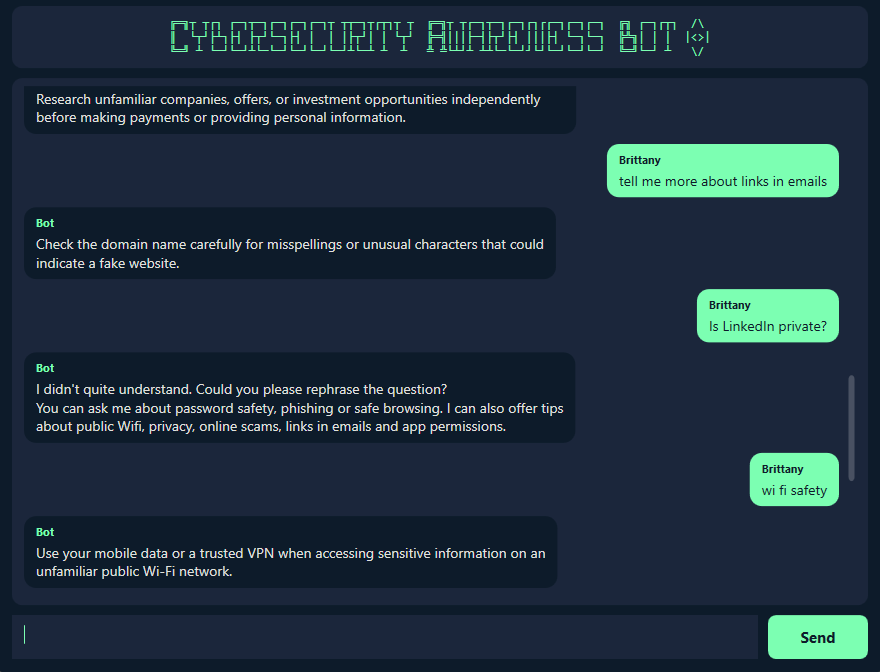
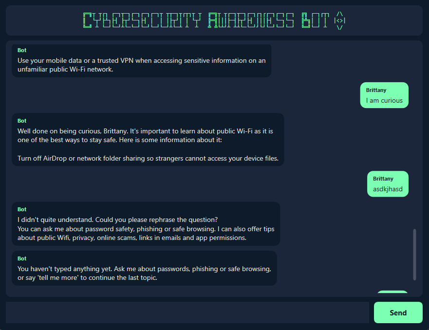
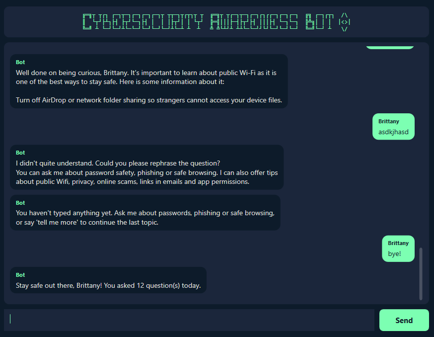
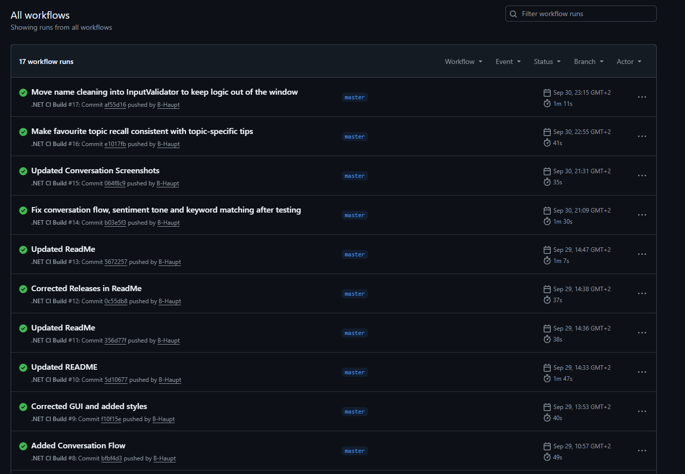

# Cybersecurity Awareness Bot - Part 3 (POE)

> **Work in progress:** Part 3 builds on the finished Part 2 chatbot below. It adds a task assistant with a MySQL database, a cybersecurity quiz, NLP command recognition and an activity log. This README will be fully updated as each feature is added.

This is a C# WPF application built for my POE assignment for Programming 2A. It is a chatbot that shares safety tips with users about how to stay safe online.

Part 2 takes the console application from Part 1 and rebuilds it as a Windows desktop application with a graphical user interface. The chatbot has now been upgraded to recognise cybersecurity keywords, give a different tip each time you ask, remember what you are interested in, detect how you are feeling, and continue a topic when you ask follow-up questions.

## Student

- **Name:** Brittany Haupt
- **Student number:** ST10500773
- **Module:** PROG6221 Programming 2A

## Project Structure

```
CybersecurityAwarenessBot.Part3/
|
|-- CybersecurityAwarenessBot.Part3.sln
|-- .github/workflows/
|   `-- dotnet-ci.yml                 # GitHub Actions CI build workflow
|
`-- CybersecurityAwarenessBot.Part3/
    |-- App.xaml                      # Colour palette, button and scrollbar styles
    |-- MainWindow.xaml               # Window layout
    |-- MainWindow.xaml.cs            # Displays messages and passes input to the bot
    |
    |-- Bot/
    |   |-- ChatBot.cs                # Decides how the chatbot replies
    |   |-- BotResponses.cs           # Keyword to tip lookup with random selection
    |   |-- SentimentAnalyser.cs      # Detects emotion using a delegate
    |   |-- InputValidator.cs         # Validates and normalises input, and extracts the user's name
    |   |-- UserProfile.cs            # Stores the user's name and interests
    |   |-- LogoArt.cs                # Supplies the ASCII art logo
    |   `-- GreetingPlayer.cs         # Plays the WAV voice greeting
    |
    |-- Media/
    |   `-- Bot.wav                   # Recorded voice greeting
    |
    `-- Pictures/                     # Screenshots used in this README
```

## Features of Project (Part 2)

- **Graphical interface**: A WPF window with an ASCII art header, a scrollable chat area and an input box. Messages appear as rounded bubbles, with the user's aligned to the right and the chatbot's to the left, so the two speakers are easy to tell apart.
- **Voice greeting**: The program starts by playing a recorded WAV file that greets the user. It uses `System.Media.SoundPlayer`, which is why the project targets `net8.0-windows`.
- **ASCII art title**: The title is displayed in colour with a shield next to it, shown after the voice greeting has finished playing.
- **Asks the user for their name**: The chatbot asks for the user's name at the start and then uses it throughout the conversation, including as the label on their messages.
- **Keyword recognition**: The chatbot recognises eleven topics, covering password safety, phishing, safe browsing, public Wi-Fi, privacy, online scams, links in emails and app permissions, as well as general questions about the bot itself.
- **Random responses**: Each topic holds several tips. The chatbot works through every tip for a topic before repeating any of them, so the conversation stays varied rather than returning the same line each time.
- **Memory and recall**: If the user says they are interested in a topic, the chatbot stores it and refers back to it later in the conversation to make its tips feel more personal.
- **Sentiment detection**: The chatbot detects when the user sounds worried, frustrated or curious, and adds a supportive message before the cybersecurity tip. This is built using a delegate, so each sentiment's reply is stored as a method in a collection.
- **Conversation flow**: Saying "tell me more" or "what else" continues the topic already being discussed instead of starting over. If the user names a new topic in the same message, that topic takes priority.
- **Input validation**: Blank and whitespace-only input is handled without the program crashing, and unrecognised questions receive a default response listing the available topics.
- **Modular structure**: The logic is split across eight classes. All the chatbot logic lives in the `Bot` folder and contains no interface code, which means the window is only responsible for displaying messages and reading input.

## Requirements

- Can only be run on Windows, because `System.Media.SoundPlayer` only works on Windows.
- Visual Studio 2022 with the .NET desktop development workload, or the .NET 8 SDK.

## How to Run

1. Clone the repository.
2. Open `CybersecurityAwarenessBot.Part3.sln` in Visual Studio 2022.
3. Press Ctrl+F5 to build and run the project.

## Topics

The chatbot can give tips on the following topics:

1. Password safety
2. Phishing
3. Safe browsing
4. Public Wi-Fi
5. Privacy
6. Online scams
7. Links in emails
8. App permissions

It also answers these general questions:

1. "How are you?"
2. "What is your purpose?"
3. "What can I ask you about?"

You can say "tell me more", "what else" or "another tip" at any point to hear another tip on the topic you are already discussing.

## Example of a Conversation with the Chatbot













## Continuous Integration

The workflow is set up in GitHub so that every push triggers it. The workflow checks out the code, installs the .NET 8 SDK, restores dependencies and builds the solution in Release configuration. A Windows runner is used because the project targets `net8.0-windows`.



## Releases

| Version | What it added |
|---------|---------------|
| v2.0 | WPF project set up, Part 1 classes ported, window layout built |
| v2.1 | Random response cycling, name capture, farewell message |
| v2.2 | Memory, sentiment detection, conversation flow and GUI polish |

## Video Presentation

YouTube link: https://youtu.be/0m7sGRJJiXM